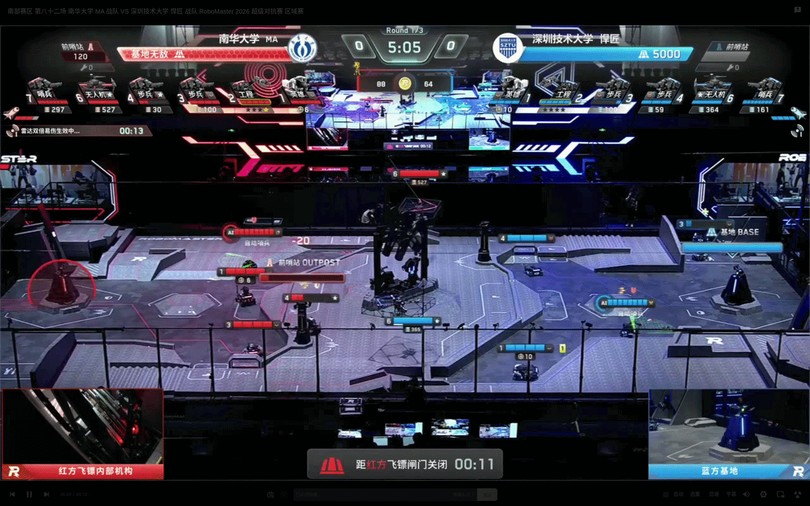

# 🎯 Dart Vision — 飞镖自动瞄准视觉系统

## Deploy

### Prerequisites
1. Install [MindVision SDK](https://mindvision.com.cn/category/software/sdk-installation-package/) and [HikRobot SDK](https://www.hikrobotics.com/cn2/source/support/software/MVS_STD_GML_V2.1.2_231116.zip)
2. Setup USB2CAN
    1. Create rules file:
        ```
        sudo touch /etc/udev/rules.d/99-can-up.rules
        ```
    2. Put the following into the file:
        ```
        ACTION=="add", KERNEL=="can0", RUN+="/sbin/ip link set can0 up type can bitrate 1000000"
        ACTION=="add", KERNEL=="can1", RUN+="/sbin/ip link set can1 up type can bitrate 1000000"
        ```
### Ubuntu 24.05
1. Install other dependencies:
    ```bash
    sudo apt install -y \
        git \
        g++ \
        cmake \
        can-utils \
        libopencv-dev \
        libfmt-dev \
        libeigen3-dev \
        libspdlog-dev \
        libyaml-cpp-dev \
        libusb-1.0-0-dev \
        nlohmann-json3-dev \
        screen
    ```
2. Install [OpenVINO](https://docs.openvino.ai/2023.3/openvino_docs_install_guides_installing_openvino_from_archive_linux.html)


3. 
```bash
cd build
make -j8
./build/dart_debug
```


## 🏗️ 系统架构

### 数据流总览

```
┌─────────────┐      ┌────────────────┐      ┌──────────────────┐
│  相机采集线程  │ ───▶ │  飞镖灯点检测器  │ ───▶ │   位姿解算 aim()  │
│ (最新帧优先)  │      │  DartDetector  │      │  (PnP + 角度修正) │
└─────────────┘      └────────────────┘      └──────────────────┘
                                                      │
                                                      ▼
┌─────────────┐      ┌────────────────┐      ┌──────────────────┐
│ 电控 / 云台  │ ◀─── │  串口通信 Hseven │ ◀─── │   yaw 指令生成    │
│   执行瞄准   │      │ (MA帧+CRC16校验) │      │ (节流+平滑+门控)  │
└─────────────┘      └────────────────┘      └──────────────────┘
        ▲                      │
        └──── 电控回传 offset（云台当前偏移角）──┘
```

主程序在 `src/dart.cpp`（生产版）中每帧执行：

1. 从阻塞队列取最新一帧图像（队列容量为 1，旧帧自动丢弃，保证低延迟）
2. 检测画面中的绿色发光板，得到 `LightSpot`（圆心、半径、轮廓）
3. 利用 PnP 解算发光板在相机坐标系下的位置，计算偏航角 yaw
4. 将 yaw 指令经串口发送给电控，驱动云台转向飞镖靶

### 目录结构

```
Dart_Vision/
├── src/                    # 主程序入口
│   ├── dart.cpp            # 生产版主循环（无 GUI，由守护脚本托管）
│   └── dart_debug.cpp      # 调试版（带 GUI 可视化 + 平滑滤波）
├── io/                     # IO 抽象层
│   ├── camera.cpp          # 相机工厂：按配置创建不同品牌相机
│   ├── mindvision/         # 迈威工业相机驱动（USB 断线自愈）
│   ├── hikrobot/           # 海康工业相机驱动（Bayer 转 BGR）
│   ├── usbcamera/          # 普通 UVC 相机驱动（V4L2，四路独立曝光）
│   ├── interface/hseven.cpp# 串口通信：MA 帧协议 + CRC16 + 自动重连
│   └── serial/             # 跨平台串口库（第三方）
├── tasks/auto_dart/        # 核心任务：飞镖灯点检测与位姿解算
├── tools/                  # 通用工具库
│   ├── trajectory.cpp      # 弹道解算（斜抛运动求俯仰角）
│   ├── math_tools.cpp      # 四元数/欧拉角/球坐标变换
│   ├── logger.cpp          # spdlog 日志（控制台 + 文件）
│   ├── dart_recorder.cpp   # 异步视频录制
│   └── ...
├── calibration/            # 离线标定工具
│   ├── calibrate_camera.cpp            # 相机内参标定
│   ├── calibrate_handeye.cpp           # 手眼标定（相机↔云台）
│   ├── calibrate_robotworld_handeye.cpp# 世界系手眼标定
│   └── capture.cpp         # 标定数据采集（图像 + IMU 四元数）
├── configs/                # yaml 配置文件
├── autostart.sh            # 开机自启脚本
└── watchdog.sh             # 进程守护脚本（崩溃自动重启）
```

---

## 🎯 核心算法

### 灯点检测

检测流程针对飞镖靶**绿色指示灯**定制，简单高效：

1. **绿色通道分离** — 提取 BGR 的 G 通道，充分利用绿灯特征
2. **高斯滤波** — 15×15 内核降噪，抑制传感器噪声
3. **二值化** — 固定阈值分割，提取高亮灯点区域
4. **轮廓提取** — `findContours` 获取候选区域外轮廓
5. **圆形度判定** — 计算 `4π·面积/周长²`，过滤非圆形干扰
6. **高度区域过滤** — 只保留画面中间区域的灯点，排除场上其他干扰光源


### 依赖

- CMake ≥ 3.16.3，C++17
- OpenCV（core / imgproc / highgui / imgcodecs / calib3d / videoio）
- Eigen3 · spdlog · fmt · yaml-cpp · nlohmann_json
- 迈威 MVSDK / 海康 MvCameraControl SDK（按使用的相机选择性安装）
- libusb-1.0

## 🎥 标定流程

要获得准确的瞄准精度，相机标定是必不可少的一步：

1. **采集数据** — 运行 `capture`，将标定板摆放在飞镖靶位置附近，按 `s` 键保存不同角度下的图像（同时自动记录 IMU 四元数）
2. **相机内参标定** — 运行 `calibrate_camera`，输出 `camera_matrix` 和 `distort_coeffs`
3. **手眼标定** — 运行 `calibrate_handeye`（或 `calibrate_robotworld_handeye`），求出相机与云台之间的外参 `R_camera2gimbal` / `t_camera2gimbal`
4. **回填配置** — 将标定结果写入 `configs/dart.yaml`

## 比赛的效果视频




## 📄 License

本项目基于同济sp魔改版,遵循开源协议，欢迎交流学习。